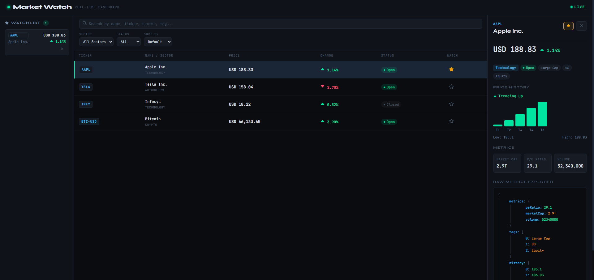

# Market Watch - Real-Time Market Dashboard

## 🚀 **[Live App:](https://usmanshaikh.github.io/market-watch-dashboard/)**

A real-time financial instrument dashboard built with React, TypeScript, and Vite.

---

## How to Run

```bash
git clone https://github.com/usmanshaikh/market-watch-dashboard
cd market-watch-dashboard
npm install
npm run dev
```

Open [http://localhost:5173](http://localhost:5173)

---

## Architecture Overview

```
src/
├── components/
│   ├── Chart/
│   │   ├── Chart.tsx              # Simple bar chart
│   │   └── Chart.scss
│   │
│   ├── DetailsPanel/
│   │   ├── DetailsPanel.tsx      # Selected instrument details view
│   │   └── DetailsPanel.scss
│   │
│   ├── Filters/
│   │   ├── Filters.tsx           # Sector, status, sort controls
│   │   └── Filters.scss
│   │
│   ├── InstrumentItem/
│   │   ├── InstrumentItem.tsx    # Single row/card UI
│   │   └── InstrumentItem.scss
│   │
│   ├── InstrumentList/
│   │   ├── InstrumentList.tsx    # List + loading state
│   │   └── InstrumentList.scss
│   │
│   ├── RecursiveViewer/
│   │   ├── RecursiveViewer.tsx   # Render nested JSON recursively
│   │   └── RecursiveViewer.scss
│   │
│   ├── SearchBar/
│   │   ├── SearchBar.tsx         # Search input
│   │   └── SearchBar.scss
│   │
│   ├── Watchlist/
│   │   ├── Watchlist.tsx         # Redux watchlist UI
│   │   └── Watchlist.scss
│   │
│   └── index.ts                  # Barrel export for components
│
├── store/
│   ├── store.ts                 # Redux store setup
│   └── watchlistSlice.ts        # Add/remove/update watchlist
│
├── data/
│   └── instruments.ts           # Mock data (initial dataset)
│
├── types/
│   └── index.ts                 # Shared TypeScript types
│
├── App.tsx                      # Main container (state + logic)
├── App.scss                     # Global layout styles
├── index.scss                   # Base styles
└── main.tsx                     # App entry point
```

---

### Screenshot



---

### State Management

- Local state (useState) handles UI concerns: search, filters,
  sort, selected instrument, loading
- Redux Toolkit handles watchlist - shared persistent state
  that needs to survive across components
- Watchlist is persisted to localStorage automatically

---

### Real-Time Updates

- setInterval fires every 2 seconds
- Only instruments with marketStatus "Open" receive price updates
- setState updater is kept pure - no side effects inside
- Redux sync happens in a separate useEffect watching instruments
- clearInterval cleanup runs on unmount

---

### Performance

- useMemo: filtered list, sectors dropdown, selected instrument
- useCallback: row selection handler, close handler
- React.memo: SearchBar, Filters, InstrumentItem - components
  whose props don't change on price ticks
- shallowEqual in Watchlist useSelector to avoid extra renders

---

## Assumptions Made

- Mock data is treated as the live data source - no backend needed
- Price updates simulate realistic small movements (0.5% max per tick)
- Closed markets (INFY) intentionally receive no price updates
- Watchlist persists in localStorage across page refreshes
- Chart shows last 5 price points only - sufficient for trend view

---

## Improvements With More Time

1. WebSocket layer - replace setInterval with a proper WS
   abstraction that could connect to a real feed
2. Unit tests - Jest + React Testing Library for filtering logic,
   Redux slice, and component render states
3. Authentication - mocked JWT auth with trader/viewer roles
   controlling add-to-watchlist permissions
4. Virtualized list - react-virtual for handling hundreds of
   instruments without performance issues
5. Keyboard navigation - arrow keys to move between rows,
   Enter to open details, Escape to close
6. Route separation - /dashboard, /watchlist, /instrument/:id
   using React Router
7. Accessibility - aria-labels, focus management, screen reader support
8. Error boundary

---
